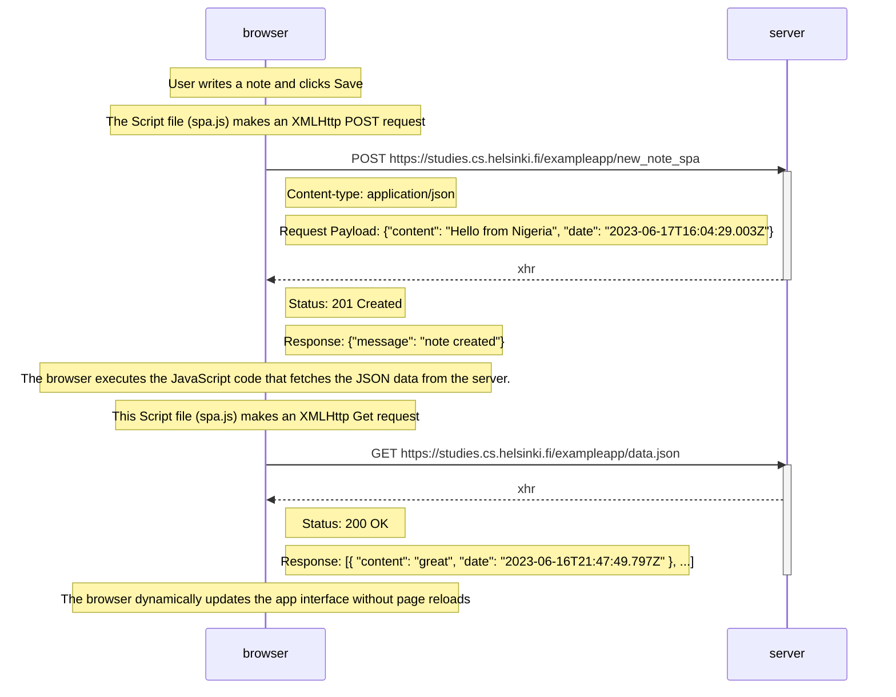

```mermaid
sequenceDiagram
    participant browser
    participant server

    Note over browser: User writes a note and clicks Save
    Note over browser: The Script file (spa.js) makes an XMLHttp POST request

    browser->>server: POST https://studies.cs.helsinki.fi/exampleapp/new_note_spa
    activate server
    Note right of browser: Content-type: application/json
    Note right of browser: Request Payload: {"content": "Hello from Nigeria", "date": "2023-06-17T16:04:29.003Z"}
    server-->>browser: xhr
    deactivate server
    Note right of browser: Status: 201 Created
    Note right of browser: Response: {"message": "note created"}

    Note over browser:  The browser executes the JavaScript code that fetches the JSON data from the server.
    Note over browser: This Script file (spa.js) makes an XMLHttp Get request

    browser->>server: GET https://studies.cs.helsinki.fi/exampleapp/data.json
    activate server
    server-->>browser: xhr
    Note right of browser: Status: 200 OK
    Note right of browser: Response: [{ "content": "great", "date": "2023-06-16T21:47:49.797Z" }, ...]
    deactivate server

    Note over browser: The browser dynamically updates the app interface without page reloads

```
