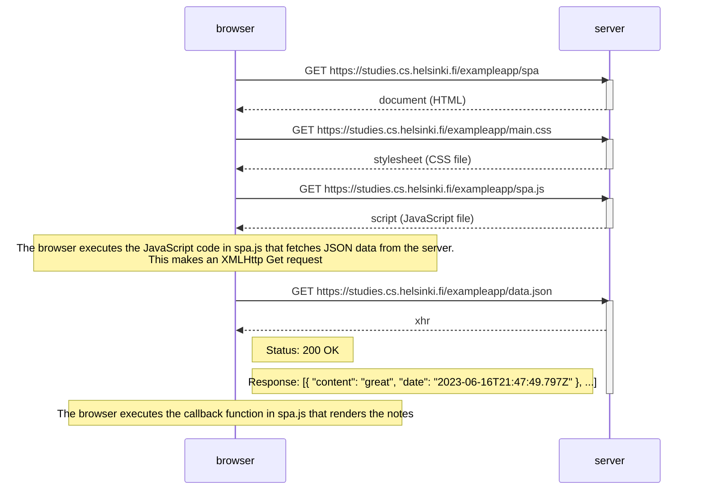

```mermaid
sequenceDiagram
    participant browser
    participant server


    browser->>server: GET https://studies.cs.helsinki.fi/exampleapp/spa
    activate server
    server-->>browser: document (HTML)
    deactivate server

    browser->>server: GET https://studies.cs.helsinki.fi/exampleapp/main.css
    activate server
    server-->>browser: stylesheet (CSS file)
    deactivate server

    browser->>server: GET https://studies.cs.helsinki.fi/exampleapp/spa.js
    activate server
    server-->>browser: script (JavaScript file)
    deactivate server

    Note over browser: The browser executes the JavaScript code in spa.js that fetches JSON data from the server.<br>This makes an XMLHttp Get request

    browser->>server: GET https://studies.cs.helsinki.fi/exampleapp/data.json
    activate server
    server-->>browser: xhr
    Note right of browser: Status: 200 OK
    Note right of browser: Response: [{ "content": "great", "date": "2023-06-16T21:47:49.797Z" }, ...]
    deactivate server

    Note over browser: The browser executes the callback function in spa.js that renders the notes
```
